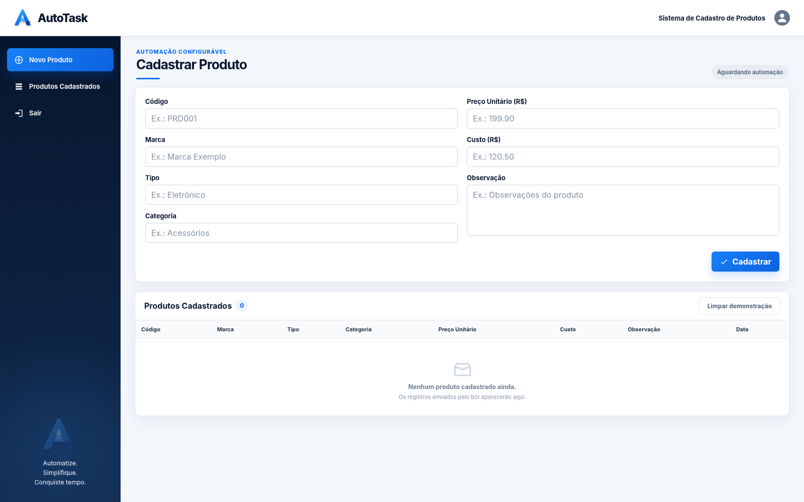

# AutoTask Bot

[English version](README.en.md)

Automação configurável em Python para preencher formulários web compatíveis com navegação por teclado a partir de dados armazenados em arquivos CSV.

A proposta central do estudo é: **pandas lê e valida os dados, enquanto PyAutoGUI controla o navegador por meio do teclado e do mouse**. O site **AutoTask**, incluído no repositório, funciona como ambiente demonstrativo e não define a lógica do motor de automação.



## Recursos

- Leitura e validação de arquivos CSV com pandas.
- Preenchimento sequencial de formulários com PyAutoGUI.
- Configuração externa da URL, do login, dos campos e do método de envio.
- Suporte a valores vindos do CSV, textos fixos e variáveis de ambiente.
- Navegação por foco e pela tecla `Tab`, sem imagens-âncora específicas.
- Calibração de posições relativas para páginas externas.
- Site demonstrativo com identidade visual própria.
- Janela de navegador dedicada para evitar abas extras e mudanças acidentais de layout.
- Supressão preventiva de avisos de primeiro uso, navegador padrão e salvamento de senha.
- Confirmação do login e de cada cadastro pelo título da janela.
- Bloqueio contra duas execuções simultâneas.
- Interrupção segura pelo `FAILSAFE` do PyAutoGUI.

## Fluxo

```text
produtos.csv ──► pandas ──► config.json ──► PyAutoGUI ──► formulário web
```

## Estrutura do repositório

```text
autotask-bot/
├── bot.py
├── config.json
├── produtos.csv
├── requirements.txt
├── setup.bat
├── run.bat
├── calibrate.bat
├── preview-site.bat
├── README.md
├── README.en.md
├── CHANGELOG.md
├── LICENSE
├── .gitignore
├── .gitattributes
├── .editorconfig
├── docs/
│   ├── autotask-login.png
│   └── autotask-dashboard.png
└── site-demo/
    ├── index.html
    ├── produtos.html
    ├── login.js
    ├── produtos.js
    ├── styles.css
    └── assets/
        ├── logo.svg
        └── favicon.svg
```

## Requisitos

- Windows 10 ou Windows 11.
- Python 3.10 ou superior.
- Navegador com suporte à navegação por teclado.

Durante a instalação do Python no Windows, recomenda-se marcar a opção **Add Python to PATH**.

## Execução rápida

Execute:

```text
run.bat
```

O script procura o Python nesta ordem:

1. Python Launcher: `py -3`.
2. Comando `python`.
3. Comando `python3`.

Na primeira execução, ele cria o ambiente virtual `.venv`, instala as dependências e inicia a automação. O site demonstrativo é aberto em uma janela dedicada do navegador, sem usar `Win + ↑`, redefinir o zoom ou criar automaticamente várias abas. A inicialização também desativa o aviso de navegador padrão, os prompts de primeiro uso e a oferta de salvar a senha em navegadores Chromium compatíveis.

### Execução pelo terminal

```powershell
python -m venv .venv
.venv\Scripts\activate
python -m pip install -r requirements.txt
python bot.py
```

## Site demonstrativo

O repositório inclui uma interface local com login, formulário de cadastro e tabela de produtos.

Credenciais:

```text
E-mail: usuario@demo.com
Senha:  demo123
```

Para abrir somente a interface:

```text
preview-site.bat
```

## Configuração

As regras de automação ficam em `config.json`. É possível configurar:

- Caminho do CSV.
- URL do formulário.
- Servidor demonstrativo local.
- Etapa de login.
- Ordem dos campos.
- Origem dos valores.
- Quantidade de pressionamentos de `Tab` após cada campo.
- Foco inicial.
- Método de envio.
- Modo de abertura do navegador.
- Título esperado em cada etapa.
- Confirmação da conclusão de cada envio.
- Intervalos e pausas.

### Campo vindo do CSV

```json
{
  "source": "column",
  "name": "codigo",
  "tabs_after": 1
}
```

### Texto fixo

```json
{
  "source": "literal",
  "value": "texto fixo",
  "tabs_after": 1
}
```

### Variável de ambiente

```json
{
  "source": "env",
  "name": "AUTOTASK_EMAIL",
  "tabs_after": 1
}
```

No PowerShell:

```powershell
$env:AUTOTASK_EMAIL = "seu-email@exemplo.com"
```

Credenciais reais não devem ser salvas em `config.json` nem enviadas ao GitHub.

## Adaptação para outro formulário

1. Altere `browser.url` em `config.json`.
2. Defina `browser.demo_server.enabled` como `false`.
3. Informe em `browser.ready_title_contains` um trecho do título da página inicial.
4. Configure a etapa de login e `login.success_title_contains`, quando necessário.
5. Organize `form.fields` na mesma ordem de navegação da página.
6. Escolha o método de confirmação em `form.confirmation`.
7. Execute `calibrate.bat` caso o formulário não aplique foco automaticamente ao primeiro campo.

A calibração registra a posição do primeiro campo como uma proporção da janela, evitando coordenadas absolutas vinculadas a uma resolução específica.

### Abertura do navegador

O modo padrão é `app`, que abre uma janela Chromium dedicada e sem abas. O AutoTask procura automaticamente Microsoft Edge, Google Chrome, Opera GX ou Opera.

```json
{
  "launch_mode": "app",
  "executable": "auto",
  "suppress_default_browser_prompt": true,
  "suppress_password_save_prompt": true,
  "use_dedicated_profile": true,
  "profile_directory": "%LOCALAPPDATA%\\AutoTaskBot\\BrowserProfile",
  "dismiss_startup_prompts": true,
  "dismiss_post_login_prompts": true
}
```

O perfil dedicado fica fora do repositório e é usado apenas durante a execução do AutoTask. Isso evita que abas, sessões anteriores e configurações do perfil pessoal interfiram no fluxo. Antes de abrir o navegador, o bot registra nesse perfil que o serviço de credenciais e o salvamento de senhas estão desativados — uma proteção incluída após problemas recorrentes observados durante os testes. Ele também envia `Esc` de forma controlada antes e depois do login e confirma novamente que a janela do AutoTask recuperou o foco.

Os argumentos preventivos usados por padrão são:

```text
--no-first-run
--no-default-browser-check
--disable-default-apps
--disable-session-crashed-bubble
```

Argumentos extras podem ser incluídos na lista `browser.extra_arguments`.

As preferências abaixo são aplicadas automaticamente ao perfil dedicado quando `suppress_password_save_prompt` está ativo:

```text
credentials_enable_service = false
credentials_enable_autosignin = false
profile.password_manager_enabled = false
profile.password_manager_leak_detection = false
```

Essas alterações afetam apenas o perfil exclusivo do AutoTask e não modificam as senhas nem as preferências do perfil pessoal do usuário.

Também estão disponíveis:

- `new_window`: abre uma janela normal separada.
- `system`: utiliza o navegador padrão do sistema, sem garantia de supressão dos prompts.
- Um caminho explícito em `browser.executable`, quando necessário.

### Confirmação das etapas

O bot não avança após o login até encontrar o título configurado em `login.success_title_contains`. No site demonstrativo, cada cadastro altera o contador exibido no título da janela; o próximo registro só começa após essa alteração ser detectada.

```json
{
  "confirmation": {
    "method": "title_change",
    "timeout_seconds": 4.0
  }
}
```

Para páginas externas, também é possível usar `title_contains` ou uma espera controlada com `wait`.

## Métodos de foco

Preservar o foco definido pela própria página:

```json
{
  "method": "current"
}
```

Avançar pelo teclado:

```json
{
  "method": "tab",
  "count": 1
}
```

Usar uma posição relativa à janela:

```json
{
  "method": "click_relative",
  "relative_to": "window",
  "x": 0.426,
  "y": 0.368
}
```

## Segurança durante a execução

Mova o cursor para o canto superior esquerdo da tela para ativar o `FAILSAFE` do PyAutoGUI e interromper o bot.

Também é possível encerrar a execução pelo terminal usando `Ctrl+C`.

## Limitações

A descrição tecnicamente adequada do projeto é:

> Automação configurável para formulários web compatíveis com navegação por teclado.

CAPTCHAs, iframes, componentes personalizados, validações assíncronas e mecanismos anti-automação podem exigir configuração adicional ou impedir o funcionamento na versão atual.

Além disso:

- O navegador precisa permanecer visível.
- A prevenção de pop-ups é mais confiável nos modos `app` e `new_window`, com um navegador Chromium detectado.
- A confirmação por título depende de um título de janela previsível.
- O mouse e o teclado ficam ocupados durante a execução.
- Mudanças na ordem dos campos exigem ajustes no `config.json`.
- A calibração pode precisar ser refeita após mudanças significativas na janela.
- O projeto é educacional e não deve ser utilizado para contornar controles de acesso.

## Licença

Distribuído sob a licença MIT. Consulte [LICENSE](LICENSE).

## Histórico do projeto

Este projeto é a evolução natural de uma primeira versão criada em 2023. Como aquela versão foi desenvolvida e mantida apenas em ambiente local, não há um histórico público que permita acompanhar toda a evolução do código ao longo dos anos.

No entanto, publiquei no meu portfólio imagens da versão de estudos de 2023, que permitem comparar as duas etapas do projeto: [ver projeto original no portfólio](https://lucasmori.com/projeto/rpa-cadastro-automatico).
